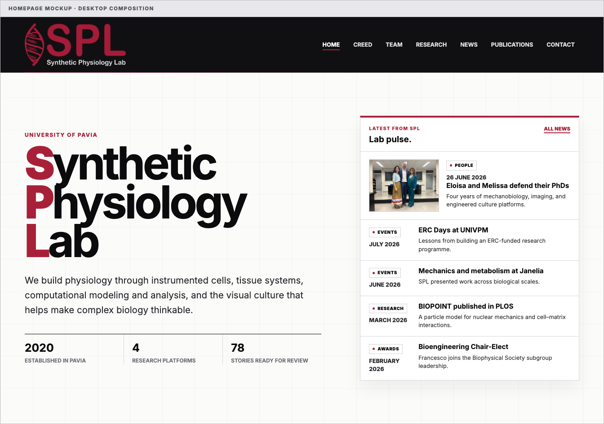
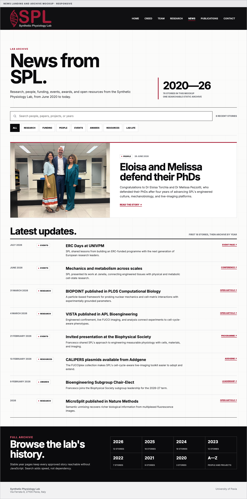
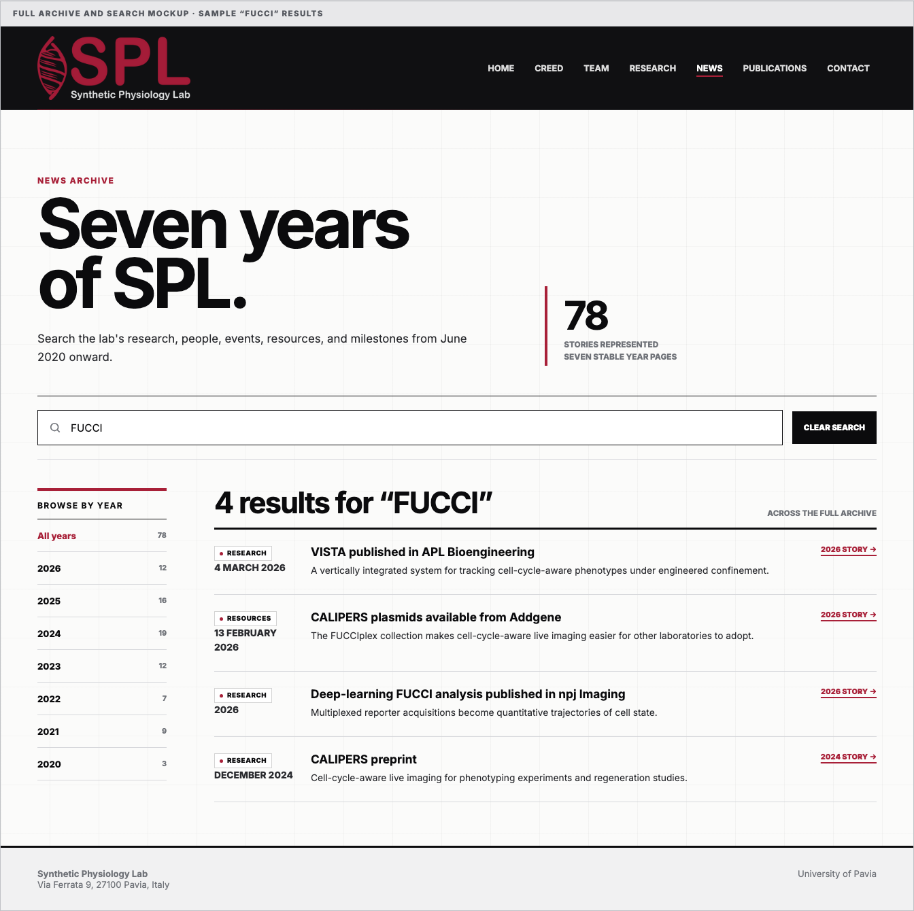
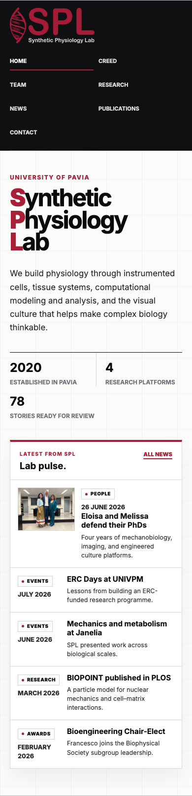
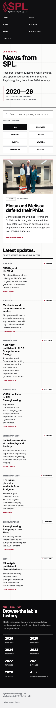
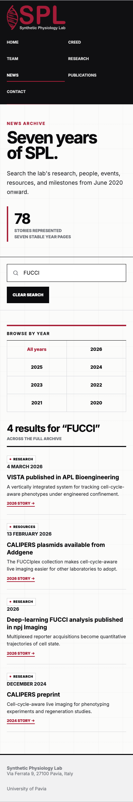

# SPL news archive visualization design

**Status:** Interactive mockups ready for Francesco's review; no frontend implementation yet.

**Scope:** Make a growing news archive pleasant on the homepage and current-news page while keeping older entries searchable from June 2020 onward.

## Editorial premise

The archive is primarily a record of the lab, not an image gallery. Most entries should therefore be compact, text-first items with a date, category, headline, short blurb, and one useful public link. Images are optional. The Eloisa Torchia and Melissa Pezzotti PhD-defense photograph can remain the featured exception.

Conference participation uses a consistent neutral vocabulary such as “presented SPL's work at …”. The archive names a talk type only when the evidence explicitly identifies it as invited, keynote, or plenary. Personnel departures use a warm, general best-wishes message without personal circumstances or next-job speculation.

## Proposed information architecture

### Homepage

- Show the five most recent or editorially featured entries.
- Allow at most one image-led item; render the remaining items as compact text rows.
- Keep a prominent “All news” link.
- Do not make the homepage responsible for filtering or searching the archive.

### News landing page

- Show the newest 18 entries in descending order.
- Use compact text cards with category, month/year or date, title, blurb, and optional external link.
- Put the one optional featured image above or alongside the first item only, rather than repeating image layouts throughout the list.
- Provide category filters for `Research`, `Funding`, `People`, `Events`, `Awards`, `Resources`, and `Lab life`. Visitors and seminars map to `Events`; Art and science remains a secondary topic rather than another primary category.
- Provide year shortcuts for every represented year.
- End the first page with a clear “Browse the full archive” section rather than rendering every item in one long DOM.

### Archive and search

- Give each year a stable URL such as `/news/2024/`.
- Add a small client-side search input on `/news/archive/` that searches a build-generated JSON index containing title, blurb, category, year, and people.
- Search results link to the relevant year and entry anchor.
- Keep search entirely static: no server, database, or third-party search dependency.
- When JavaScript is unavailable, year links still expose the complete archive.
- Filters on the news landing page affect only the 18 recent entries. Archive search searches every approved entry.

## Mockups

The mockups use the current SPL logo, paper/ink/red palette, square rules, Inter typography, and the existing PhD-defense photograph. They are visual references, not frontend code. Counts use the 78 `READY` ledger entries and must later be generated from approved data.

[Open the interactive HTML mockup](./mockups/spl-news-archive/finalized.html). The search, category filters, clear-search action, and zero-result state work in the standalone file.

### Homepage news rail

One compact image-led story and four text rows preserve the existing split hero without turning the rail into a carousel or an internal scroll area.



### First news page

The defense is a separate spotlight, even when it is not the newest item. The following 17 entries form a flat chronological index rather than a card grid. The mockup shows eight representative rows to keep the review image readable.



### Full archive and search

The archive defaults to a year directory. The captured state demonstrates a cross-year search for `FUCCI`, an explicit result count, clear-search action, stable year navigation, and links back to anchored stories.



### Mobile behavior

At 390 px, the feature becomes a full-width 4:3 image with copy below it; filters wrap into visible 44 px controls; year navigation becomes a two-column grid; archive results become single-column editorial rows. The mockup has no horizontal overflow.

| Homepage | News landing | Archive search |
|---|---|---|
|  |  |  |

### Interaction states represented

- Idle archive: year directory and search field.
- Results: query, exact count, and anchored story links.
- Zero results: short explanation plus clear-search action.
- Cleared search: focus returns to the search input.
- No JavaScript: direct year links remain usable.

## Content model

The eventual structured dataset should use one record per story:

```ts
type NewsEntry = {
  id: string;
  date: string; // ISO sorting date; use first of month for month-only evidence
  datePrecision: "day" | "month" | "year";
  category: "research" | "funding" | "people" | "events" | "awards" | "resources" | "labLife";
  title: string;
  blurb: string;
  links?: { label: string; href: string }[];
  people?: string[];
  topics?: string[];
  order?: number; // deterministic tie-break for month/year-only entries
  featured?: boolean;
  image?: { src: string; alt: string };
};
```

`datePrecision` controls public display, while the ISO date and optional editorial `order` keep sorting deterministic. `links` supports stories such as the joint PhD defense that have more than one useful public destination. `topics` supports Art and science or a research platform without multiplying primary categories. An entry should not need an image. The archive-candidate ledger remains the editorial source until Francesco approves individual records for transfer into this dataset.

Each story also receives a stable anchor derived from `id`, for example `/news/2026/#calipers-addgene`. The story title may still link to an external source, but archive search always has a stable internal destination.

## Why this fits the current site

The existing Astro implementation already derives homepage and news-page content from one static data module. The proposed design preserves that build-time model. It changes only how many entries are rendered at once and adds small static year pages plus a compact search index.

The current image-card grid is the fragile part on narrow screens. Making normal archive rows text-only removes that pressure and lets the single defense photograph remain meaningful instead of turning images into a requirement for every historical story.

## Acceptance criteria for implementation

- Homepage shows no more than five entries and remains readable at 320 px width.
- News landing page shows no more than 18 entries before archive navigation.
- Every approved story is reachable without JavaScript through a year page.
- Search finds entries by title, blurb, category, year, and named person.
- Search and category filtering are keyboard accessible and announce result counts.
- Search has tested idle, populated, zero-result, and clear-search states.
- Category remains readable text and is never communicated through color alone.
- Filter, year, and clear-search controls have a minimum 44 px touch target.
- External links are visibly identified and have meaningful labels.
- Month-only and year-only dates are displayed without inventing a day.
- The site builds successfully and has no horizontal overflow at 320, 390, 768, and 1440 px widths.
- A test fixture with at least 100 entries remains usable and does not materially change homepage height.

## Deliberately deferred

- No infinite scroll.
- No external search service.
- No requirement to source historical photographs.
- No automatic publication of connector-derived facts.
- No frontend code until the archive and this design are reviewed.
